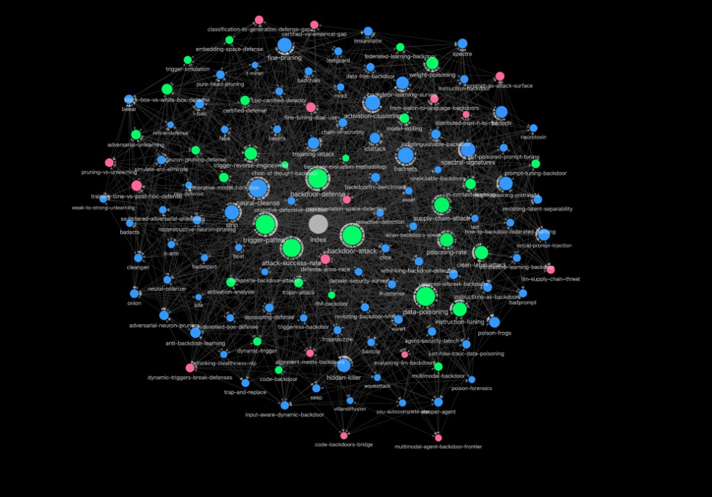

# LLM Backdoor Defense — Knowledge Base

A research knowledge base on **backdoor attacks and defenses in Large Language Models**, powered by Claude Code and following [Andrej Karpathy's LLM Wiki pattern](https://gist.github.com/karpathy/442a6bf555914893e9891c11519de94f).

**150 papers** | **61 concepts** | **40 connections** | **~192,000 words** — interlinked and browsable in Obsidian.

**LLM Brain:** Claude Code (no API key needed — Claude Code does all compilation, Q&A, and generation directly)



## The Idea

Most people's experience with LLMs and documents looks like RAG: upload files, retrieve chunks at query time, generate an answer. The LLM rediscovers knowledge from scratch on every question. Nothing compounds.

This is different. The LLM **incrementally builds and maintains a persistent wiki** — a structured, interlinked collection of markdown files that sits between you and the raw sources. When you add a new paper, the LLM reads it, extracts key information, and integrates it into the existing wiki — updating concept pages, revising connection articles, strengthening or challenging the evolving synthesis. The knowledge is compiled once and kept current, not re-derived on every query.

**The wiki is a persistent, compounding artifact.** The cross-references are already there. The contradictions have already been flagged. The synthesis already reflects everything you've read.

You never write the wiki yourself — the LLM writes and maintains all of it. You're in charge of sourcing, exploration, and asking the right questions.

## Research Domain

Detection and mitigation of backdoor attacks in Large Language Models, grounded in mechanistic interpretability of model internals and informed by knowledge editing research.

## Research Coverage

The knowledge base covers the full landscape of LLM backdoor research across five pillars:

| Pillar | Papers | Key Topics |
|--------|--------|------------|
| **Backdoor Attacks** | ~65 | Data poisoning (BadNets, Sleeper Agent), NLP/LLM attacks (Hidden Killer, VPI, BadEdit, JailbreakEdit), prompt tuning, multimodal (BadCLIP, BadVision, BadToken), RLHF poisoning, code generation, model merging, PEFT/adapter, distillation-conditional |
| **Backdoor Defenses** | ~60 | Trigger inversion (Neural Cleanse, BAIT), pruning (ANP, PURE), unlearning (I-BAU, SAU, BEEAR), activation analysis (spectral signatures, ASSET), certified (TextGuard, Fuzzed RS), LLM-specific (CROW, RepBend, PEFTGuard), inference-time (STRIP, ONION) |
| **Mechanistic Interpretability** | ~8 | Circuits (Zoom In), superposition (Toy Models), sparse autoencoders (Towards Monosemanticity, SAE-VLM), activation patching, representation engineering |
| **Knowledge Editing** | ~10 | ROME, MEMIT, MEND, PMET, AlphaEdit, ripple effects, edit tracing/reversal, EasyEdit evaluation |
| **Layer-Wise Representation Dynamics** | ~9 | CKA, residual stream analysis, logit/tuned lens, DoLA, ITI, contrastive activation addition, belief state geometry, attention sinks, representation progression |

### Venue Coverage

| Category | Venues |
|----------|--------|
| **ML/AI (A*)** | NeurIPS, ICML, ICLR, AAAI, IJCAI |
| **NLP** | ACL (A*), EMNLP (A), NAACL (A), TACL (A*) |
| **Computer Vision** | CVPR (A*), ICCV (A*), ECCV (A) |
| **Security** | IEEE S&P (A*), CCS (A*), USENIX Security (A*), NDSS (A) |
| **Interpretability** | Distill, Anthropic Transformer Circuits Thread |

### Concept Articles (61)

Structured explainer articles covering: attack fundamentals (backdoor attacks, clean-label attacks, trigger patterns, dynamic triggers, syntactic triggers), attack surfaces (instruction tuning, supply chain, RLHF, code, multimodal, federated learning), attack properties (fine-tuning resistance, task-agnostic backdoors, safety backdoors, embedding-space attacks), defense approaches (trigger reverse engineering, adversarial unlearning, spectral analysis, pruning, invariance training, data sanitization, bilevel optimization, gradient-based trigger discovery), interpretability toolkit (mechanistic interpretability, causal tracing, circuit analysis, superposition, sparse autoencoders, layer-wise analysis, prediction trajectories, rank-one model editing), and evaluation metrics (attack success rate, clean accuracy, evaluation methodology).

### Connection Articles (40)

Cross-cutting analyses including: defense arms race, trigger type taxonomy, editing as attack and defense, superposition and backdoor hiding, defense scalability to frontier models, information-theoretic detection limits, behavioral vs. representational removal, cooperative multi-agent backdoors, defense composition, verification without retraining, **knowledge editing x backdoor research frontier**, **steering vectors as backdoor detectors**, a **defense comparison report**, and a prioritized **research roadmap** synthesizing open problems across the entire field.

## How It Works

```
raw/ sources  -->  Claude Code (interactive)  -->  wiki/ (.md files)  -->  Q&A / Search / Slides
                          |                              |                        |
                    discuss & guide              viewable in Obsidian        file back into wiki
```

### Three Layers

| Layer | What | Who maintains |
|-------|------|---------------|
| **Raw sources** (`raw/`) | Immutable source documents — papers, articles, notes | You add them; LLM reads but never modifies |
| **The wiki** (`wiki/`) | Structured, interlinked markdown — summaries, concepts, connections | LLM writes and maintains; you read and guide |
| **The schema** (`CLAUDE.md`) | Operating guide — conventions, workflows, formats | You and LLM co-evolve over time |

### Operations

1. **Ingest** — Add a source to `raw/`, discuss key takeaways with the LLM, it writes wiki articles, updates the index, touches 5-15 pages per source. Prefer one-at-a-time with discussion for quality; batch ingest also available.
2. **Query** — Ask questions; LLM reads index first to find relevant pages, synthesizes answers with `[[wiki-link]]` citations. **Valuable answers get filed back into the wiki** so explorations compound.
3. **Lint** — Two levels: structural (broken links, missing frontmatter) and **exploratory** (missing concept pages, thin coverage areas, data gaps, research questions to investigate). Lint drives discovery.
4. **Generate** — Slide decks (Marp), reports, charts (matplotlib), comparison matrices. Outputs filed back into wiki.
5. **Log** — Chronological record in `log.md` of everything that happens. Parseable: `grep "^## \[" log.md | tail -10`.

## Quick Start

### 1. Install dependencies

```bash
cd llm-knowledge-base
pip3 install -r requirements.txt
```

### 2. Set your research domain

```bash
python3 run.py init
# Prompts for domain name and description
```

### 3. Open in Obsidian

Open the `llm-knowledge-base/` folder as an Obsidian vault. The `.obsidian/` config is pre-set with:
- Dark theme
- Graph view color-coded (blue=papers, green=concepts, orange=connections)
- Backlinks and outgoing links panels
- Marp Slides community plugin enabled

**First time in Obsidian:** Settings -> Community Plugins -> Enable -> Browse -> Install "Marp Slides" and "Dataview"

### 4. Add source documents

```bash
# Add a paper
python3 run.py ingest add path/to/paper.md --venue NeurIPS --year 2024 -t backdoor -t defense

# Or just drop files into raw/ and scan
python3 run.py ingest scan

# List all ingested sources
python3 run.py ingest list
```

### 5. Compile the wiki (ask Claude Code)

In Claude Code, say:
> "Compile the wiki from my raw sources"

The LLM reads your raw files, writes structured wiki articles, extracts concepts, finds connections, and builds the index. Stay involved — read the summaries in Obsidian, guide what to emphasize.

### 6. Use the knowledge base

```bash
# Ask Claude Code questions:
#   "What are the main findings about X?"
#   "Compare method A vs method B"
#   "Generate a slide deck on topic Y"
#   "Run a health check on the wiki"
#   "What research directions are unexplored?"

# Search from CLI
python3 run.py search "trigger pattern"

# Start web search UI
python3 run.py search serve
# -> http://localhost:8877
```

## Wiki Structure

### Papers (`wiki/papers/`)

Each paper article includes YAML frontmatter with Dataview-compatible tags:

```yaml
---
title: "Paper Title"
venue: "Venue"
year: 2024
summary: "One sentence"
tags:
  - defense
  - pruning
threat_model: "data-poisoning"
compiled: "2026-04-04T12:00:00"
---
```

Tags enable Obsidian Dataview queries:
```dataview
TABLE venue, year, summary FROM "wiki/papers"
WHERE contains(tags, "defense") AND contains(tags, "pruning")
SORT year DESC
```

### Concepts (`wiki/concepts/`)

Explainer articles with: definition, background, technical details, variants, key papers, related concepts, open problems.

### Connections (`wiki/connections/`)

Cross-cutting articles highlighting non-obvious relationships between papers and concepts from different categories. Include key insights, implications, and open questions.

### Index (`wiki/index.md`)

Master index organizing all 252 articles by category with `[[wiki-links]]` for full Obsidian graph connectivity. The LLM reads this first to navigate the wiki.

## Obsidian Web Clipper

To quickly save web articles as raw sources:

1. Install [Obsidian Web Clipper](https://obsidian.md/clipper) browser extension
2. Configure it to save to your `raw/` directory
3. When you find an article, click the clipper -> saves as `.md` in `raw/`
4. Run `python3 run.py ingest scan` to register it
5. Run `python3 run.py images download` to download remote images to local
6. Ask Claude Code to compile the new source

## Image Handling

```bash
# Download all remote images in raw/ markdown files to local
python3 run.py images download

# Download images from a specific file
python3 run.py images download raw/article.md

# List all local images
python3 run.py images list
```

This rewrites markdown image references to local paths so Obsidian can display them offline.

## All CLI Commands

```bash
python3 run.py status                        # Knowledge base overview
python3 run.py init                          # Set research domain
python3 run.py quickstart                    # Getting started guide

# Ingestion
python3 run.py ingest add <file>             # Add source file
python3 run.py ingest scan                   # Detect new files
python3 run.py ingest list                   # List all sources
python3 run.py ingest uncompiled             # Show what needs compiling
python3 run.py ingest mark-compiled <file>   # Mark as compiled
python3 run.py ingest mark-all-compiled      # Mark all compiled
python3 run.py ingest reset-compiled         # Reset for rebuild

# Compilation helpers
python3 run.py compile status                # Compilation status
python3 run.py compile rebuild               # Reset + clear wiki
python3 run.py compile clear                 # Clear wiki only

# Images
python3 run.py images download               # Download remote images
python3 run.py images list                   # List local images

# Search
python3 run.py search "query"                # CLI search
python3 run.py search "query" -j             # JSON output
python3 run.py search serve                  # Web UI

# Q&A helpers
python3 run.py qa topics                     # List wiki articles
python3 run.py qa context                    # Wiki summary
python3 run.py qa context --full             # Full wiki text
python3 run.py qa file-to-wiki <file> -s <section>  # File output into wiki

# Linting
python3 run.py lint check                    # Structural checks
python3 run.py lint stats                    # Wiki statistics

# Slides
python3 run.py slides list                   # List slide decks
```

## Directory Structure

```
llm-knowledge-base/               <- Obsidian vault root
├── .obsidian/                     <- Pre-configured vault settings
├── raw/                           <- Raw source documents (150 papers, immutable)
│   ├── images/                    <- Downloaded images from sources
│   └── _manifest.json             <- Ingestion metadata
├── wiki/                          <- Compiled wiki (252 articles, ~192K words)
│   ├── index.md                   <- Master index (LLM reads first for navigation)
│   ├── papers/                    <- 150 paper summary articles (Dataview-tagged)
│   ├── concepts/                  <- 61 concept explainer articles
│   └── connections/               <- 40 cross-topic connection articles
├── output/                        <- Generated outputs
│   ├── slides/                    <- Marp slide decks
│   ├── images/                    <- Generated visualizations & heatmaps
│   └── reports/                   <- Q&A reports (file valuable ones back into wiki)
├── log.md                         <- Chronological activity log
├── tools/                         <- CLI tool scripts (~1,650 lines Python)
├── config.yaml                    <- Domain config, venues, search settings
├── requirements.txt               <- Python deps (no API client needed)
├── CLAUDE.md                      <- Claude Code operating guide (co-evolving schema)
├── IDEA.md                        <- Reference: Karpathy's LLM Wiki pattern
└── run.py                         <- CLI entry point
```

## Stats

| Metric | Count |
|--------|-------|
| Raw sources | 150 |
| Paper articles | 150 |
| Concept articles | 61 |
| Connection articles | 40 |
| Total wiki articles | 252 |
| Total words | ~192,000 |
| Wiki links | ~6,000 |
| Unique link targets | ~266 |
| Dataview-tagged papers | 150/150 |
| Lint issues | 0 |

## Why This Works

The tedious part of maintaining a knowledge base is not the reading or the thinking — it's the bookkeeping. Updating cross-references, keeping summaries current, noting when new data contradicts old claims, maintaining consistency across hundreds of pages. LLMs don't get bored, don't forget to update a cross-reference, and can touch 15 files in one pass. The wiki stays maintained because the cost of maintenance is near zero.

The human's job is to curate sources, direct the analysis, ask good questions, and think about what it all means. The LLM's job is everything else.
